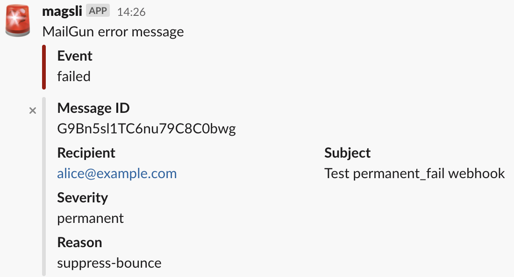

# magsli

Provides an endpoint for MailGun's webhooks which will format and send messages to a Slack webhook.

## Mirror

The [main repo is on GitLab](https://gitlab.com/asmaloney/magsli) and it is mirrored to other sites. [Issues](https://gitlab.com/asmaloney/magsli/-/issues) and [merge requests](https://gitlab.com/asmaloney/magsli/-/merge_requests) are accepted on GitLab.

## Use Case

I host multiple containerized WordPress sites that each use MailGun for sending email. Occasionally I get a customer who cannot receive email this way (their systems reject it), but MailGun doesn't notify me that delivery failed. I wanted an alert so I can go look at the logs to see what's happening and contact the customer directly.

## Design Goals

This was designed to solve a particular problem: _How do I receive a notification in Slack for any errors that happen when MailGun is delivering mail?_

As far as I can tell there's no way to receive notification of errors other than webhooks, and there isn't an official integration with Slack anywhere. I did find [SlackGun](https://github.com/slickplaid/node-slack-mailgun), but it doesn't meet my needs.

I wanted this to be:

- small &amp; simple
- designed for a docker container
- low maintenance
- self contained (limited vendoring/external libraries<sup>\*</sup>)

(<sup>\*</sup> I chose not to use the full [mailgun-go](https://github.com/mailgun/mailgun-go) dependency because it pulls in a bunch of other dependencies. Instead I reference one of the internal packages and I duplicate a couple of structures and one function.)

## Building

I have included a Makefile that builds both a macOS and a statically linked Linux version, so you can use `make` to build both or `make macos` and `make linux` to build them individually.

I cross-compile it on macOS to create a static build that I just drop into a container on my Digital Ocean droplet (Ubuntu).

## Usage

It's meant to be used in a container, so the interface is quite minimal. When it is run, magsli will look for the following environment variables:

- **MAILGUN_API_KEY** - your MailGun private API key
- **SLACK_WEBHOOK_URL** - the URL of your Slack webhook to posting to
- **SERVER_SSL_CERT_FILE** - path to your server's SSL certificate file
- **SERVER_SSL_KEY_FILE** - path to your server's SSL private key file

Example for docker-compose:

```
  magsli:
    ...
    environment:
      MAILGUN_API_KEY: key-<long hex number> (which probably comes from your .env file)
      SLACK_WEBHOOK_URL: https://hooks.slack.com/services/<long random text>
      SERVER_SSL_CERT_FILE: "/etc/nginx/certs/<domain name>.crt"
      SERVER_SSL_KEY_FILE: "/etc/nginx/certs/<domain name>.key"
```

These options may also be specified on the command line:

```
Usage: ./magsli [options]
Options:
  -mailgun string
    	MailGun API Key
  -slack string
    	Slack webhook to post to
  -sslCert string
    	Path to server certificate file
  -sslKey string
    	Path to server private key file
```

However you choose to deploy **magsli**, once you have a URL for the service (e.g. https://foo.com/magsli), you can simply set it as the URL in the MailGun webhook settings for each event you want to be notified on.

## FAQ

**What does a message look like?**



**This could be useful to me, but it doesn't do/show "X". Can you make it do/show "X"?**

I probably could, but I probably won't if "X" breaks any of my design goals. Please [submit an issue](https://gitlab.com/asmaloney/magsli/-/issues) and we can discuss it keeping in mind that one of the main design goals of this project is small &amp; simple (see above).

I would suggest if you need customizability that you fork this repo and make your changes. (If you release your fork publicly, please change the name to avoid confusion.)

**I found a bug. Will you fix bugs?**

Absolutely! Please [submit an issue](https://gitlab.com/asmaloney/magsli/-/issues) and we can work through it.
